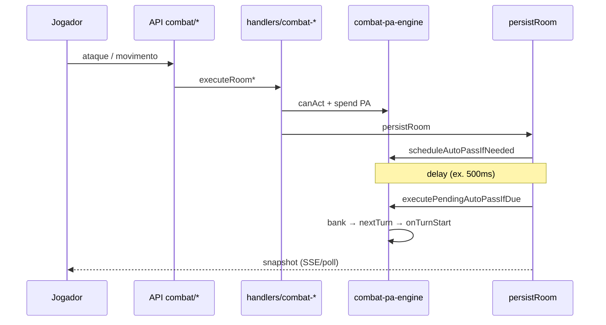

# Combate na Mesa Eldarin — Guia técnico e de regras

> Documento gerado a partir da varredura do código (`lib/combat/`, `lib/room/`, `app/api/room/`, `components/vtt/`) e dos PRDs em `docs/PRD-COMBATE-MESA-REFACTOR.md` e `docs/VTT-ACOES-PA-AREAS.md`.  
> **Fonte de verdade em runtime:** o servidor (`persistRoom` + handlers). O PRD descreve a **intenção**; este guia separa o que **já roda** do que **ainda falta**.

---

## 1. Visão geral

A mesa Eldarin é um VTT em grid quadrado (1 célula ≈ 1,5 m) com economia de **Pontos de Ação (PA)**. O combate não é um módulo isolado: ele cruza:

- **Estado da sala** (`RoomState`: `scene`, `actors`, `combat`, `settings`, `chat`)
- **Tokens no mapa** (`BattleToken`: PA, movimento, condições, vínculo com ficha)
- **Motor de PA** (`lib/combat/combat-pa-engine.ts`)
- **APIs REST** (`POST /api/room/[roomId]/combat/*`, `tokens/move`, etc.)
- **UI** (`Battlefield`, `TokenActionRing`, `TurnOrderPanel`, HUD)

**North star (PRD):** o grupo joga a sessão inteira no browser; o mestre narrativa, o VTT resolve PA, turno, dano e condições no servidor.

---

## 2. Três modos de jogo (fases de PA)

O motor classifica a mesa em uma de três fases (`CombatPaPhase` em `lib/combat/combat-pa-phase.ts`):

| Fase | Quando | PA | Turno |
|------|--------|-----|-------|
| **`exploration`** | `settings.combatActive === false` | Só **exibição** — ações **não debitam** PA de verdade | Sem fila; qualquer um move/agir |
| **`combat_free`** | Combate ligado, mas `combat.order` vazio | PA **real** para todos os tokens no mapa | Sem restrição de “só o ativo” |
| **`combat_turn`** | Combate ligado + ordem de iniciativa preenchida | PA real + **só o token ativo** age | Fila + auto-pass ao zerar PA |

```text
exploration  ──(GM liga combate)──►  combat_free
combat_free  ──(GM rola iniciativa)──►  combat_turn
combat_turn  ──(GM desliga combate)──►  exploration
```

**Como deve funcionar (livro + PRD):**

- **Fora de combate:** movimento livre, magias sem custo de PA (R18).
- **Em combate livre:** útil para posicionar antes da iniciativa; todos gastam PA mas não há “vez de quem”.
- **Em combate com turno:** iniciativa define a fila; cada criatura usa seus PA no seu turno e o turno avança quando PA acaba (auto-pass) ou quando passa manualmente.

**Como está no código:** as três fases estão implementadas. `spendPaForRoomAction` (`lib/combat/pa-spend-room.ts`) ignora débito em `exploration`. `canActOnCombatTurn` (`lib/combat/turn-guard.ts`) só bloqueia em `combat_turn`.

---

## 3. Estado de combate (`CombatTrack`)

Definido em `lib/room/combat.ts` e persistido em `eldarin_rooms.combat` (JSON).

| Campo | Função |
|-------|--------|
| `order` | IDs dos tokens, maior iniciativa primeiro |
| `activeIndex` | Índice do token cuja vez é agora |
| `round` | Número da rodada (incrementa quando a fila volta ao início) |
| `notices` | Mensagens curtas para toast na UI (consumidas ao avançar) |
| `naturalOrder` | Ordem da última rolagem de iniciativa (GM pode restaurar) |
| `orderOverridden` | `true` se o mestre reordenou manualmente |
| `initiativeRolled` | `true` após `roll-initiative`; senão ordem = posição no mapa |
| `pendingAutoPass` | `{ tokenId, passAt }` — auto-pass agendado após PA = 0 |
| `paRefreshTurnKey` | `"round:tokenId"` — evita dar PA duas vezes no mesmo turno |
| `roundCheckpoints` | Até **20** snapshots de início de rodada (GM restaura) |

Funções centrais:

- `rollInitiative(room)` — 1d20 + mod de **Destreza** (`attributes.destreza`), desempate **d100**
- `nextTurn(combat)` — avança índice; se volta a 0, `round++`
- `activeTokenId(combat)` — quem está na vez
- `normalizeCombatTrack` — remove tokens órfãos da ordem

---

## 4. Fluxo de um turno (como deve funcionar)

### 4.1 Entrar em combate

1. **Mestre** liga modo combate (`PATCH settings` com `combatActive: true` ou ação GM `set-combat-mode`).
2. Se ainda não há iniciativa:
   - Ordem pode ser a **posição no mapa** (`applyMapPlacementCombatOrder` em `lib/room/combat-order.ts`).
   - PA cheio para todos (`onEnterCombatFree` → `grantCombatPaToAllTokens`).
3. **Mestre** rola iniciativa: `POST /api/room/[roomId]/combat/roll-initiative`.
   - Calcula ordem, `initiativeRolled: true`, zera pools se necessário, concede PA ao primeiro vivo.
   - Fase passa para **`combat_turn`**.

### 4.2 Durante o turno do token ativo

O jogador (ou mestre, no caso de monstro) pode:

| Ação | Rota | Custo típico |
|------|------|----------------|
| Mover | `POST .../tokens/move` | 1 PA no 1º bloco; faixas walk/run |
| Atacar | `POST .../combat/attack` | 2 PA (arma/magia de combate) |
| Habilidade | `POST .../combat/ability` | 2 PA (ou 1 para ações rápidas) |
| Magia de área | `POST .../combat/area` | 2 PA + alvo em grid |
| Consumir item | `POST .../combat/consume` | 2 PA (poções etc.) |

Antes de cada ação o servidor:

1. Verifica `canActOnCombatTurn` (só o ativo, salvo exploração/combat_free).
2. Verifica controle do token (`canControlToken`).
3. Chama `ensureSpendableBeforeAction` / `prepareCombatToken`.
4. Debita PA via `spendPaForRoomAction`.
5. Aplica efeitos (dano, condições, chat, undo).
6. **`persistRoom`** — pode agendar auto-pass.

**Importante:** `effectiveBypassTurn` e `gmBypassAppliesToToken` **sempre retornam `false`**. Nem o mestre age fora da vez em combate com fila (só passa turno ou usa GM reorder).

### 4.3 Fim do turno

Dois caminhos:

**A) Auto-pass (padrão)** — `lib/combat/combat-pa-engine.ts`:

- Após ação, se PA gastável = 0, já gastou PA no turno (`paSpentThisTurn > 0`) e não restam opções de 0 PA (ex.: caminhada grátis do talento O Peão), agenda `pendingAutoPass`.
- Delay: `settings.autoPassDelayMs` (padrão **500 ms**, mínimo 200 ms). PRD sugere ~1,5 s — **discrepância**.
- Em todo `persistRoom`, `executePendingAutoPassIfDue` executa se `Date.now() >= passAt`.

**B) Pass manual** — `POST .../combat/next-turn` com `{ force: true }`:

- Quem pode: mestre **ou** controlador do token ativo (`canAdvanceCombatTurn`).
- Sem `force`, a rota só dispara auto-pass pendente (não pula turno à força).

**Transição de turno** (`applyTurnPaTransition` em `handlers/combat-turn.ts`):

1. Banca PA do token que terminou (`bankActiveTokenPa`).
2. `nextTurn` — incrementa rodada se necessário.
3. Em nova rodada: checkpoint, tick de efeitos temporários, **death track** (+1 em inconscientes).
4. Reseta movimento do turno (`resetAllTokenMovement`).
5. Pula mortos / atordoados (`shouldAutoSkipTurn`).
6. `onTurnStart` — refresh de PA (+5 PCs, cap 9) para o novo ativo.



---

## 5. Economia de PA (regras implementadas)

Constantes em `lib/combat/pa-economy.ts` (alinhadas ao Livro Cap. 2.6 / 3.1):

| Regra | PCs | Monstros |
|-------|-----|----------|
| Recuperação por turno | **+5 PA** | **6** (comum) / **8** (miniboss/boss) |
| Teto de acúmulo (pool) | **9** (+ talentos, ex. Lobo Solitário → 11) | **6** comum (sem sobra) / **8** boss |
| Custo padrão de ação | **2 PA** (ataque, magia combate, habilidade) | idem |
| Atordoado | PA = 0, sem banco | idem |

### Início do turno

`refreshPaAtTurnStart` (`lib/combat/pa-turn.ts`):

```text
pa_novo = min(cap, pa_atual + recuperação - paRecoveryDebt)
```

- `paRecoveryDebt`: débito de reação (PRD R23) — **função existe**, triggers de reação **não estão ligados** nas rotas.
- Talentos alteram recuperação, cap e PA fixo no início (`paTurnRulesForActor`).

### Fim do turno

`bankPaAtEndOfTurn`: sobra vai para o pool até o cap; excesso é **descartado** (aviso em `notices`).

### Movimento e PA

`lib/vtt/movement-pa.ts` — faixas derivadas de `walk` / `run` do token:

- **1º bloco** (até 2 células se walk ≥ 2): **1 PA** ao entrar na faixa.
- **Meio (caminhada):** células sem PA extra até `runChargeFrom`.
- **Corrida:** a partir de `runChargeFrom`, +1 PA a cada N células (`runBlockSize`).

Talent **O Peão:** 1 PA do bloco básico grátis, 1× por turno (`effectiveMovementPaCost`).

### Estribilho, chi, recarga

| Recurso | Arquivo | Regra |
|---------|---------|-------|
| Estribilho | `lib/combat/estribilho.ts` | 1 PA; máx. 2× a **mesma** magia nv.0 no turno |
| Chi (Espiritualista) | `lib/combat/chi-economy.ts` | Pool separado; reset no início do turno |
| Recarga 1/turno ou 1/combate | `lib/combat/recharge.ts` | Habilidades com limite |

### Sincronização ficha ↔ token

`syncActorPaFromToken` (`lib/combat/combat-token-pa.ts`): `token.pa` ↔ `actor.resources.pontosAcao.value`.

---

## 6. Tipos de ação (pipelines)

### 6.1 Ataque — `handlers/combat-attack.ts` → `lib/combat/attack.ts`

1. Resolve loadout (`CombatLoadout`: arma/magia/habilidade equipada).
2. Ramifica: habilidade, magia utilitária, magia com save, ou ataque corpo-a-corpo/distância (`resolveTokenAttack`).
3. d20 com vantagem/desvantagem (`lib/combat/d20.ts`), dano, resistências (`damage-resist.ts`), HP temporário.
4. Friendly fire em área: modal na UI (`FriendlyFireConfirmDialog`) antes de confirmar (PRD R27).
5. Registra undo (`combat-undo.ts`, máx. 24 entradas, só GM reverte).

### 6.2 Habilidade — `handlers/combat-ability.ts` → `lib/combat/ability.ts`

Buffs, marcas, carga, cura, restrições, etc. via `abilityEffect` no JSON do compêndio.

### 6.3 Magia de área — `handlers/combat-area.ts` → `lib/combat/area-spell.ts`

- Formas em `lib/vtt/grid-area.ts`: burst, wall, cone, line, cube.
- Cone/line exigem `areaDirection`.
- Exige ator PC linkado para conjurar.

### 6.4 Consumível — `handlers/combat-consume.ts` → `lib/combat/consumables.ts`

Poções e itens do inventário do ator; custo padrão 2 PA; pode curar área de aliados.

### 6.5 Movimento — `handlers/tokens.ts` → `lib/vtt/movement.ts`

- Pathfinding no grid (`lib/vtt/grid-path.ts`).
- `canMoveToken` valida alcance, ocupação, PA.
- **GM reposition** (`tokens/reposition`): ignora PA e turno.

---

## 7. Iniciativa e ordem

| Situação | Comportamento no código |
|----------|-------------------------|
| Rolagem GM | `1d20 + mod(DEX)` por token; desempate d100; depois nome |
| Sem rolagem | Ordem = ordem dos tokens no array `scene.tokens` |
| Token derrotado | Removido da ordem até reviver (`syncCombatOrderWithTokens`) |
| Atordoado / inconsciente | Turno **pulado** automaticamente |
| Entrada tardia (PRD R20) | **Lacuna:** spawn **appende** na ordem imediatamente (`handlers/tokens.ts`), não “fim da rodada” |
| Surpresa | **Não implementado** |

GM pode: reordenar, definir ativo, adiar token (`defer-turn`), restaurar ordem natural (`combat/gm`).

---

## 8. Morte, HP e condições

`lib/combat/death-track.ts` (PRD R25):

| Evento | Efeito |
|--------|--------|
| HP → 0 | Condição **inconsciente**; `deathTurns` inicia em **−1** |
| Dano extra em 0 HP | Não piora abaixo de −1 |
| Início de cada **rodada** | `deathTurns++` se ainda inconsciente e sem cura |
| `deathTurns >= 10` | `defeated: true` (morto) |

Condições gerais: `lib/combat/conditions.ts`. Efeitos com duração: `lib/combat/timed-effects.ts` (tick em fim de turno / nova rodada).

**XP:** derrota de monstro → `combat-defeat-rewards.ts`; GM pode desativar XP de monstros nas settings ou dar XP/nível via `combat/gm`.

---

## 9. Permissões (mestre vs jogador)

`lib/auth/combat-turn-access.ts`:

| Capacidade | Mestre | Jogador |
|------------|--------|---------|
| Ver HP de todos | ✅ | Só PCs linkados; monstros se `showMonsterHpToPlayers` |
| Ver PA de monstros | ✅ | ❌ |
| Ver PA do próprio PC | ✅ | ✅ (ficha linkada) |
| Controlar monstro | ✅ | ❌ (exceto delegação) |
| Controlar próprio token | ✅ | ✅ |
| Rolar iniciativa | ✅ | ❌ |
| Passar turno | ✅ sempre | ✅ se controla o ativo |
| Reordenar / undo / checkpoint | ✅ | ❌ |
| Agir fora da vez (combate com fila) | ❌ | ❌ |

**Delegação:** `token.delegatedToUserId` permite outro jogador controlar o token (`TokenDelegatePanel`, rota `tokens/[tokenId]/delegate`).

Snapshot filtrado: `lib/room/snapshot-for-viewer.ts` esconde `combatUndo`, `combatLog`, HP/PA de monstros conforme permissão.

---

## 10. Controles do mestre (API `combat/gm`)

`GmCombatAction` em `lib/room/handlers/combat-gm.ts`:

| Ação | Efeito |
|------|--------|
| `reset-pa` | PA cheio num token |
| `defer-turn` | Token vai para o fim da fila |
| `restore-order` | Volta `naturalOrder` |
| `set-order` | Ordem manual + ativo opcional |
| `set-active` | Define quem está na vez |
| `revert` | Desfaz ação (undo stack) |
| `restore-round` | Restaura checkpoint de rodada |
| `set-combat-mode` | Liga/desliga combate |
| `grant-xp-all` | XP para todos os PCs |
| `level-up-all` | Sobe 1 nível todos |
| `set-hp` | Ajusta HP (e max/temp) de token |

---

## 11. Interface (componentes)

| Componente | Papel |
|------------|-------|
| `Battlefield.tsx` | Canvas principal: grid, tokens, modos de alvo, área, friendly fire |
| `TokenActionRing.tsx` | Menu radial: mover, atacar, magia, habilidade, consumível, ficha |
| `TokenActionPanel.tsx` | Variante em painel lateral |
| `TurnOrderPanel.tsx` | Fila de iniciativa, passar turno, controles GM |
| `CharacterCombatHud.tsx` | HUD de combate (HP, PA, condições) |
| `BattlefieldActionHud.tsx` | Preview ao passar o mouse (alcance, PA) |
| `CombatChatCard.tsx` | Mensagens de combate no chat |
| `CombatFxLayer.tsx` | Efeitos visuais (hit, cast) |
| `GmMesaModeToggle.tsx` | Liga/desliga combate |
| `GmActionHistoryPanel.tsx` | Histórico + undo |
| `SpellPickerPanel.tsx` / `SpellChannelControl.tsx` | Escolha de magia e PA de canal |
| `MesaWorkspace.tsx` | Shell que monta mesa + sync |

**Hooks:** `useRoomSync.ts` (API client), `useCombatActions.ts`, `useBattlefieldPointer.ts`.

**Sync:** HTTP + poll (combat ~500 ms no PRD); rota `GET .../events` (SSE) existe; estado autoritativo sempre no servidor após `persistRoom`.

---

## 12. Rotas API (combate)

| Método | Rota | Handler |
|--------|------|---------|
| POST | `/api/room/[roomId]/combat/attack` | `executeRoomAttack` |
| POST | `/api/room/[roomId]/combat/ability` | `executeRoomAbility` |
| POST | `/api/room/[roomId]/combat/area` | `executeRoomAreaSpell` |
| POST | `/api/room/[roomId]/combat/consume` | `executeRoomConsume` |
| POST | `/api/room/[roomId]/combat/next-turn` | `advanceRoomTurn` |
| POST | `/api/room/[roomId]/combat/roll-initiative` | `rollRoomInitiative` |
| POST | `/api/room/[roomId]/combat/gm` | `executeGmCombatAction` |
| POST | `/api/room/[roomId]/tokens/move` | `moveRoomToken` |
| POST | `/api/room/[roomId]/tokens/reposition` | GM, sem PA |
| PATCH | `/api/room/[roomId]/settings` | `combatActive`, `autoPassDelayMs`, flags XP |

Documentação parcial em `docs/API-SALA.md` — **faltam** `consume`, `gm` e campos de settings.

---

## 13. Mapa de arquivos (varredura)

### 13.1 Núcleo de combate (`lib/combat/`)

| Arquivo | Responsabilidade |
|---------|------------------|
| `combat-pa-phase.ts` | Três fases (exploration / combat_free / combat_turn) |
| `combat-pa-engine.ts` | **Motor central:** refresh/bank PA, auto-pass, entrada em combate |
| `pa-economy.ts` | Constantes e regras por PC/monstro/talento |
| `pa-turn.ts` | Spend, refresh, bank, stun, notices |
| `pa-spend-room.ts` | Débito phase-aware |
| `pa-cost-reduce.ts` | Descontos de PA (talentos, multi-ataque) |
| `pa-token-state.ts` | Normalização de campos PA no token |
| `turn-guard.ts` | `canActOnCombatTurn` |
| `attack.ts` | Resolução de ataque |
| `ability.ts` | Resolução de habilidades |
| `area-spell.ts` | Magias de área |
| `spell.ts`, `spell-parse.ts` | Magias com save |
| `consumables.ts` | Itens consumíveis |
| `death-track.ts` | Trilha de morte −1 → 10 |
| `conditions.ts`, `timed-effects.ts` | Status e duração |
| `d20.ts`, `hit-chance.ts`, `damage-resist.ts` | Matemática de combate |
| `estribilho.ts`, `chi-economy.ts`, `recharge.ts` | Limites por turno/combate |
| `zero-pa-options.ts` | Impede auto-pass se ainda há ação 0 PA |
| `exploration-pa.ts` | PA só visual fora de combate |
| `combat-token-pa.ts` | Sync token ↔ actor |

### 13.2 Sala e handlers (`lib/room/`)

| Arquivo | Responsabilidade |
|---------|------------------|
| `combat.ts` | Tipo `CombatTrack`, iniciativa, `nextTurn` |
| `combat-order.ts` | Sincronizar ordem, skip morto/atordoado |
| `combat-gm.ts` | Reorder, defer, reset PA |
| `handlers/combat-turn.ts` | Iniciativa, avanço de turno, auto-pass |
| `handlers/combat-attack.ts` | Pipeline ataque |
| `handlers/combat-ability.ts` | Pipeline habilidade |
| `handlers/combat-area.ts` | Pipeline área |
| `handlers/combat-consume.ts` | Pipeline consumível |
| `handlers/combat-gm.ts` | Ações GM |
| `handlers/tokens.ts` | Movimento, spawn |
| `combat-undo.ts` | Pilha de desfazer |
| `combat-round-checkpoint.ts` | Snapshots de rodada |
| `combat-log.ts` | Log de auditoria (GM) |
| `combat-defeat-rewards.ts` | XP |
| `internal/registry.ts` | **`persistRoom`** + side effects de auto-pass |
| `snapshot-for-viewer.ts` | Permissões no snapshot |

### 13.3 Movimento e grid (`lib/vtt/`)

| Arquivo | Responsabilidade |
|---------|------------------|
| `movement-pa.ts` | Custo PA por faixa |
| `movement.ts` | Validação de movimento |
| `grid-path.ts`, `grid-area.ts` | Path e formas de área |
| `types.ts` | `BattleToken`, `BattleScene` |

### 13.4 Auth

| Arquivo | Responsabilidade |
|---------|------------------|
| `lib/auth/combat-turn-access.ts` | Ver HP/PA, controlar token, passar turno |
| `lib/auth/room-access.ts` | `canManageRoom`, `canBypassCombatTurn` (sempre false) |

### 13.5 Documentação relacionada

| Doc | Conteúdo |
|-----|----------|
| `docs/PRD-COMBATE-MESA-REFACTOR.md` | PRD aprovado v4 — decisões R1–R30 |
| `docs/VTT-ACOES-PA-AREAS.md` | PA, movimento, áreas (parcialmente datado) |
| `docs/P5-COMBAT-UX.md` | UX de preview e direção de área |
| `docs/API-SALA.md` | Rotas da sala (incompleto para combate) |
| `livros/LIVRO-DO-JOGADOR.md` | Cap. 2.6 (PA), 3.1 (ações) — fonte de regras |

---

## 14. Como **deve** funcionar vs o que **falta**

### Implementado e alinhado ao PRD

- Três modos exploração / combate livre / combate com turno
- PA +5, cap 9, custo 2 PA, auto-pass ao zerar
- Iniciativa 1d20+DEX, desempate d100
- Movimento por faixas walk/run
- Morte −1 → 10 rodadas
- Friendly fire com confirmação
- Undo + checkpoint 20 rodadas (GM)
- Estribilho 2×/turno, chi, recargas
- Filtro de snapshot por permissão

### Lacunas conhecidas (código ≠ PRD)

| Item | PRD | Código hoje |
|------|-----|-------------|
| Reações v1 (oportunidade, Escudo, Contramágica) | R7, R21 | `applyReactionPaDebt` existe; **sem triggers nas rotas** |
| Entrada tardia na iniciativa | R20 | Spawn entra na ordem **na hora** |
| Delay auto-pass padrão | ~1,5 s (R22) | **500 ms** (`DEFAULT_AUTO_PASS_DELAY_MS`) |
| Boss/miniboss pool PA | PRD variante 8 | **`MONSTER_PA_BOSS = 8`** em `pa-economy.ts` |
| Atributo de iniciativa | Comentários dizem AGI | Usa **`destreza`** (DEX) |
| Surpresa | Mencionado | **Não implementado** |
| Culinária/loot pós-combate | Fase 2 (R13) | Rota `culinary/meal` separada |
| WebSocket | Fase 2 (R30) | Poll/SSE apenas |
| Bypass de turno GM | Flag legada | **Sempre desligado** |

### Checklist PRD §6

A lista de aceite em `PRD-COMBATE-MESA-REFACTOR.md` permanece em grande parte **não marcada** no arquivo — muitos itens estão parcialmente feitos no código, mas o gate formal do PRD não foi fechado.

---

## 15. Fluxo recomendado para o mestre (sessão típica)

1. **Exploração:** `combatActive = false` — grupo move livremente, PA na ficha é referência visual.
2. **Encontro:** mestre liga combate — todos recebem PA; posicionar sem fila de turno (`combat_free`).
3. **Iniciativa:** mestre rola — fila definida; primeiro token recebe PA de turno.
4. **Turnos:** cada jogador move e gasta PA (ataque 2, movimento 1 no 1º bloco, etc.); ao zerar PA, turno passa sozinho após o delay.
5. **Interrupções:** mestre pode passar turno, reordenar, resetar PA, ajustar HP, desfazer última ação ou restaurar rodada.
6. **Fim:** mestre desliga combate — volta exploração; PA deixa de ser debitado.

---

## 16. Referência rápida de funções

| Função | Onde | O quê |
|--------|------|-------|
| `resolveCombatPaPhase` | `combat-pa-phase.ts` | Qual fase a mesa está |
| `onTurnStart` / `bankActiveTokenPa` | `combat-pa-engine.ts` | Ciclo de PA |
| `scheduleAutoPassIfNeeded` | `combat-pa-engine.ts` | Agenda fim de turno |
| `applyTurnPaTransition` | `handlers/combat-turn.ts` | Avanço completo de turno |
| `canActOnCombatTurn` | `turn-guard.ts` | Porta de turno |
| `spendPaForRoomAction` | `pa-spend-room.ts` | Débito de PA |
| `resolveCombatAction` | `attack.ts` | Loadout → opção de ação |
| `persistRoom` | `internal/registry.ts` | Grava + auto-pass |
| `snapshotForViewer` | `snapshot-for-viewer.ts` | O que cada cliente vê |

---

*Última revisão: 2026-06-12 — alinhado ao branch `main` pós-migração MariaDB.*
