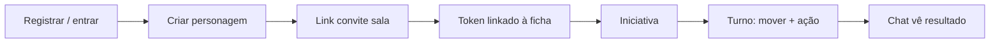
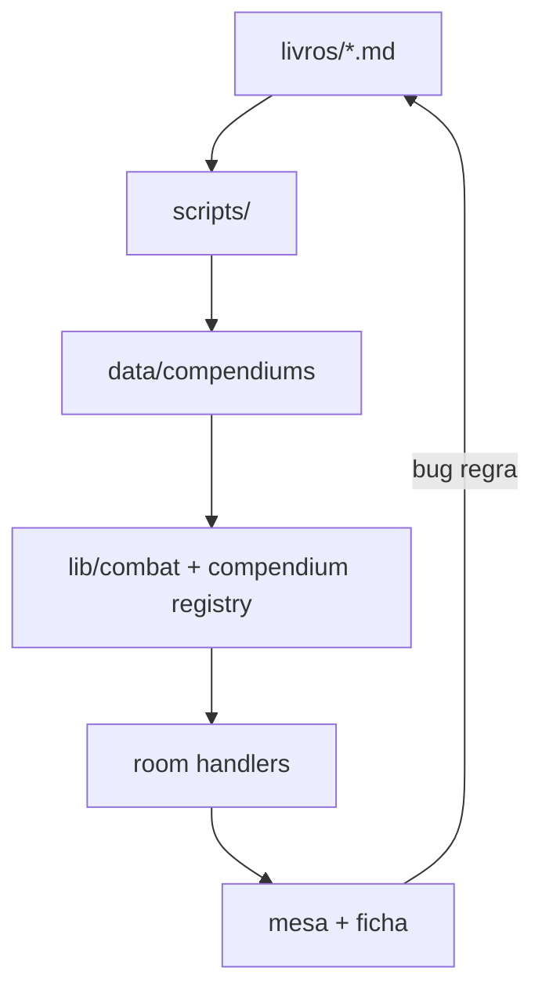

# Eldarin — RPG jogável no site (guia de estrutura)

> **Objetivo:** transformar regras + compêndios + VTT atual em **produto web funcional** — sessão completa no navegador, sem Foundry.  
> **Público:** você (produto/dev) e quem for priorizar sprint.  
> **Código vivo:** raiz do repo (`app/`, `lib/`, `data/`, `components/`). Legado: `archive/web/` (não editar).

---

## 1. O que significa “jogável no site”

Uma sessão **mínima viável** precisa cobrir este fluxo sem planilha externa obrigatória:

| # | Momento | Quem | O site deve… |
|---|---------|------|----------------|
| 1 | Entrar | Todos | Login, papel (admin / mestre / jogador) |
| 2 | Criar personagem | Jogador | Ficha com classe, raça, PA, HP, talentos, loadout |
| 3 | Entrar na sala | Todos | Convite ou link `/mesa/[roomId]` |
| 4 | Explorar | Jogador | Mover token (caminhada/corrida + PA) |
| 5 | Combater | Todos | Iniciativa → turno → ataque / magia / habilidade → chat |
| 6 | Evoluir | Jogador | XP, subir nível, PA máx atualizado |
| 7 | Mestrar | Mestre | Spawn monstro, condições, controle de turno |

**Fora do MVP web (pode ser mesa + livro):** culinária completa, 40 plantas, biomas 1–12, banquete lendário, economia ESP/MIN/TES avançada — a menos que você queira como diferencial.

---

## 2. Estado atual (fevereiro 2026)

### 2.1 Matriz “pronto / parcial / falta”

| Bloco | Status | Onde no repo |
|-------|--------|----------------|
| Mesa hex + tokens | ✅ | `components/vtt/HexBattlefield.tsx`, `lib/vtt/` |
| PA + movimento + combate | ✅ | `lib/combat/pa-economy.ts`, `lib/room/handlers/combat-*` |
| Ficha personagem | ✅ | `components/character/`, `/personagem/[id]` |
| Compêndios (armas, magias, monstros…) | ✅ | `data/compendiums/*.json` |
| API sala (ataque, magia, turno…) | ✅ | `app/api/room/`, `docs/API-SALA.md` |
| Regras PA no livro | ✅ | `livros/LIVRO-DO-JOGADOR.md` Cap. 2.6, 3.1, 12.0 |
| UX painel lateral mesa (rail) | ✅ | Compêndio rail, chat/dados scroll — [UX-MESA-E-RAIL.md](./UX-MESA-E-RAIL.md) |
| PA acúmulo + UI medidor 11 | ✅ | `PaDotMeter`, modal passar turno — PRD D27–D28 |
| Sync multiusuário | 🟡 | Poll ~2s; sem WebSocket |
| Auth produção | 🟡 | Demo cookie; registro existe |
| Persistência sala/ficha | 🟡 | Neon do zero em prod (PRD v2) — `docs/POSTGRES.md` |
| Culinária / refeição em combate | 🟡 | UI parcial; não é gate do combate |
| Saves automáticos em tudo | 🟡 | Magias com teste sim; resto Mestre |
| Névoa de guerra / LOS | ❌ | — |

Detalhe item a item: `docs/PARIDADE-FOUNDRY.md`.

### 2.2 Stack (não mudar sem motivo)

```
┌─────────────────────────────────────────────────────────┐
│  Browser — Next.js 15 + React 19 + CSS (tema Eldarin)   │
├─────────────────────────────────────────────────────────┤
│  app/          rotas + API Routes                       │
│  components/   UI, VTT, ficha                           │
│  lib/          regras, sala, combate, auth              │
│  data/         JSON gerado (fonte de verdade na mesa)   │
├─────────────────────────────────────────────────────────┤
│  livros/       regras humanas (editar → regerar data)   │
│  scripts/      geradores                                │
└─────────────────────────────────────────────────────────┘
         Deploy: Vercel (ver DEPLOY.md, PRODUTO.md)
```

---

## 3. Arquitetura em camadas (como estruturar o RPG no site)

Trate o projeto em **5 camadas**. Cada feature nova deve dizer em qual camada mora.

### Camada A — Regras (motor puro)

- **Pasta:** `lib/character/`, `lib/combat/`, `lib/vtt/movement.ts`
- **Entrada:** tipos + funções puras (sem React, sem HTTP)
- **Exemplos:** `paMaxForActor`, `effectivePaCost`, `resolveTokenAttack`, `hpMaxFor`, `extraAttackCount`
- **Fonte das regras:** `livros/LIVRO-DO-JOGADOR.md` → implementação aqui
- **Config de talentos PA:** `data/character/pa-modifiers.json` → `lib/combat/pa-economy.ts`

**Regra de ouro:** se a regra aparece na UI, ela deve existir em `lib/` primeiro.

### Camada B — Dados (compêndio)

- **Pasta:** `data/compendiums/`, `data/character/subclass-tracks.json`
- **Gerado por:** `npm run sync:data` (ver `package.json`)
- **Campos de mesa:** `system.tactical.custoPontosAcao`, `catalogId`, stats de monstro

**Regra de ouro:** não editar JSON na mão em rotina — alterar script ou seed e regerar.

### Camada C — Sala (estado da partida)

- **Pasta:** `lib/room/` (`handlers/`, `internal/`, `store.ts`)
- **Modelo:** `RoomSnapshot` = cena + atores + combate + chat + `revision`
- **Hoje:** memória processo; **alvo:** DB + sync (REFATORACAO Passo 5)

**Regra de ouro:** toda ação de mesa passa por handler → bump `revision` → cliente refetch.

### Camada D — API HTTP

- **Pasta:** `app/api/room/[roomId]/...`
- **Contrato:** `docs/API-SALA.md`
- **Auth:** `lib/auth/authorize-room.ts`

**Regra de ouro:** UI nunca calcula dano final sozinha — chama API (ou server action que chama handler).

### Camada E — UI / UX

- **Pasta:** `app/`, `components/`
- **Rotas principais:** tabela na seção 4
- **VTT:** `HexBattlefield` + painéis (`TokenActionPanel`, `MonsterSpawnPanel`, …)

**Regra de ouro:** UI só exibe e dispara; números vêm do snapshot após ação.

---

## 4. Mapa de rotas (produto)

| Rota | Papel | Função jogável |
|------|-------|----------------|
| `/` | Visitante | Landing, CTA demo |
| `/entrar` | Todos | Login / registro |
| `/jogador` | Jogador | Dashboard, fichas, entrar em campanha |
| `/mestre` | Mestre | Criar sala, convite, campanhas |
| `/admin` | Admin | Plataforma |
| `/personagem/[id]` | Jogador | Ficha completa + level-up |
| `/mesa` | — | Lista / criar mesa |
| `/mesa/[roomId]` | Todos | **Núcleo da sessão** — VTT |
| `/mesa/demo` | Demo | Sala pública teste |
| `/biblioteca` | Todos | Leitura regras / catálogos (se ativo) |
| `/sistema` | Dev | Roteiro features |

**Núcleo jogável = `/mesa/[roomId]` + `/personagem/[id]` + auth.**

---

## 5. Fluxos que o site deve suportar (user stories)

### 5.1 Jogador — primeira sessão



**Checklist implementação:**

- [ ] Conta persiste após reload (hoje: verificar auth)
- [ ] Ficha persiste (hoje: verificar se só demo local)
- [ ] Token `linked` + `actorId` na sala
- [ ] PA na UI = `paMaxForActor` após level-up
- [ ] Loadout salvo (`combatLoadout`) reflete no painel de ação

### 5.2 Mestre — one-shot

1. Criar sala → gerar `inviteCode`
2. Posicionar tokens PC (ou jogadores entram)
3. Spawn monstro (`MonsterSpawnPanel` → `monstros.json`)
4. Rolagem iniciativa → `advanceRoomTurn`
5. Durante combate: aplicar condições, bypass turno se necessário

**Checklist:**

- [ ] Sala não some após 5 min idle (persistência)
- [ ] Dois mestres/jogadores veem mesmo `revision` (sync)
- [ ] Spawn Elite/Colossal escala (`lib/vtt/monster-scaling.ts`)

### 5.3 Loop regras ↔ site



Comandos:

```bash
npm run sync:data
npm run dev
# Abrir http://localhost:3000/mesa/demo
```

---

## 6. Roadmap por fases (prioridade para “funcional”)

### Fase 0 — Já dá para jogar local / demo ✅

- Mesa demo, combate, PA, talentos PA no motor
- Ficha editável na mesma sessão (memória)

**Limitação:** deploy serverless perde sala; multijogador frágil.

### Fase 1 — MVP sessão confiável (fazer primeiro)

| # | Entrega | Por quê |
|---|---------|---------|
| 1.1 | **Persistência sala** (Postgres ou KV + snapshot JSON) | Sem isso não é produto |
| 1.2 | **Persistência ficha** por `userId` | Jogador volta amanhã |
| 1.3 | **Sync tempo real** (SSE ou WebSocket) | Dois browsers mesma mesa |
| 1.4 | **Auth produção** (sessão segura, papéis) | Não depender só demo |
| 1.5 | **Fluxo convite** documentado na UI mestre | Onboarding claro |

Referência: `REFATORACAO.md` Passo 5 e 6.

### Fase 2 — Combate “fechado” no site

| # | Entrega |
|---|---------|
| 2.1 | Toda habilidade de classe no `habilidades.json` com `custoPontosAcao` |
| 2.2 | Segundo Fôlego, Fúria, Forma Selvagem com PA explícito |
| 2.3 | Magias 2+ PA visíveis na UI (`formatPaCostLabel`) |
| 2.4 | Testes de resistência 100% no VTT (hoje parcial) |
| 2.5 | Reações (1/turno) com gasto de PA |

### Fase 3 — Progressão e campanha

| # | Entrega |
|---|---------|
| 3.1 | XP na ficha + botão “aplicar XP de combate” na sala |
| 3.2 | Level-up já existe — ligar a `paMaxForActor` + talentos nv 4/8/12/16 |
| 3.3 | Campanhas (`/api/campaigns`) com várias salas |
| 3.4 | Histórico de chat persistido |

### Fase 4 — Diferencial Eldarin (opcional web)

| # | Entrega |
|---|---------|
| 4.1 | Assimilação pós-combate (espécime 001–060) |
| 4.2 | Culinária: refeição → buff na ficha |
| 4.3 | Loot ESP/MIN/TES integrado à ficha |
| 4.4 | Bioma / pressão ambiental (Mestre) |

Não bloqueie Fase 1 por Fase 4.

---

## 7. Módulos do produto (como dividir o trabalho)

Organize sprints por **módulo**, não por “página bonita”.

| Módulo | Dono técnico | Depende de |
|--------|--------------|------------|
| **Auth & contas** | `lib/auth/`, `app/api/auth/` | DB usuários |
| **Ficha** | `components/character/`, `lib/character/normalize.ts` | DB personagem |
| **VTT core** | `HexBattlefield`, hooks `hooks/vtt/` | Snapshot sala |
| **Combate** | `lib/combat/*`, handlers `combat-*` | Compêndio + PA |
| **Compêndio UI** | painel biblioteca na mesa | `data/compendiums` |
| **Mestre** | spawn, iniciativa, condições | VTT core |
| **Regras PA/talentos** | `pa-modifiers.json`, `pa-economy.ts` | Cap. 12 livro |
| **Conteúdo** | `livros/`, scripts | — |

---

## 8. Contratos de dados (não quebrar)

### 8.1 Personagem (`CharacterSheet`)

Campos críticos para mesa:

| Campo | Uso no VTT |
|-------|------------|
| `identity.nivel`, `classe`, `subclasse`, `talentos[]` | PA, ataques extra, reduções |
| `resources.pontosAcao` | Sync token `pa` / `paMax` |
| `resources.vida` | HP token linkado |
| `combatLoadout` | Ação padrão no painel |
| `movement.walk` / `run` | Orçamento hex |
| `revision` | Conflito de edição |

### 8.2 Token (`BattleToken`)

| Campo | Uso |
|-------|-----|
| `linked` + `actorId` | Stats vêm da ficha |
| `pa`, `paMax` | Economia de turno |
| `movementSpentHex` | Caminhada/corrida |
| `conditions` | Cap. 3.4 condições |

### 8.3 Ação de combate (`CombatActionOption`)

Sempre carregar `paCost` do compêndio; aplicar `effectivePaCost(actor, action)` no servidor.

---

## 9. Conteúdo: livro → site

| Tipo conteúdo | Arquivo regra | Arquivo mesa | Gerador |
|--------------|---------------|--------------|---------|
| Armas / equip. | Catálogo + Cap. 14 | `armas.json`, `equipamentos.json` | `gen-equipment-compendium.py` |
| Magias | Cap. 10 / X | `magias.json` | `generate-compendium.mjs` |
| Monstros | Mestre bestiário | `monstros.json` | idem |
| Habilidades | Classes + Cap. 12 | `habilidades.json` | idem / manual |
| Talentos PA | Cap. 12.0 | `pa-modifiers.json` | manual (espelha livro) |
| Trilhas subclasse | Cap. 12 | `subclass-tracks.json` | `generate-subclass-tracks.mjs` |
| XP espécimes | Cap. 2.5 | `TABELA-XP-ESPECIMES.md` | futuro: coluna em monstro |

**Workflow editorial:**

1. Editar `livros/LIVRO-DO-JOGADOR.md` (ou catálogo).
2. Rodar `npm run sync:data`.
3. Testar uma ação na `/mesa/demo`.
4. Se talento novo altera PA → atualizar `data/character/pa-modifiers.json`.

---

## 10. UX mínima para “mesa séria”

| Área | Must have | Nice |
|------|-----------|------|
| Mesa | Token ativo óbvio, PA visível, erro de PA claro | FX, som |
| Ações | Lista filtrada por alcance / PA | Preview dano |
| Ficha | Abrir ao lado da mesa (split) | PDF export |
| Mestre | Spawn + iniciativa em 2 cliques | Fog of war |
| Mobile | Legível | Arrastar token touch |

---

## 11. Riscos e decisões

| Risco | Mitigação |
|-------|-----------|
| Serverless apaga sala | Fase 1 persistência |
| Regra só no livro, não no `lib/` | Checklist PR: “motor atualizado?” |
| JSON diverge do livro | `sync:data` no CI |
| Escopo culinária + VTT junto | Fase 4 separada |
| Dois `web/` | Só raiz; `archive/web` morto |

**Decisões já tomadas:** produto = VTT React na raiz; Foundry = referência (`vinite/`); DB depois mas **antes de marketing “jogue online”**.

---

## 12. Definition of Done — “site jogável v1”

Marque quando **todos** forem verdade:

- [ ] 4 jogadores + 1 mestre, browsers diferentes, mesma sala 30+ min sem perder estado
- [ ] Ficha salva; reentrar no dia seguinte com mesmo personagem
- [ ] Combate completo: iniciativa → movimento → ataque/magia/habilidade → próximo turno
- [ ] Guerreiro nv5+ paga 1 PA/golpe; mago nv5+ Afinidade Arcânica no VTT
- [ ] Mestre spawna monstro do compêndio e aplica dano via mesa
- [ ] Level-up atualiza PA máx na ficha e no token após sync
- [ ] Documentação jogador: Cap. 2.6 / 3.1 do Livro do Jogador bate com o que a UI mostra

---

## 13. Links internos

| Doc | Uso |
|-----|-----|
| [PRODUTO.md](../PRODUTO.md) | Visão produto |
| [PRD-ELDARIN-VTT.md](./PRD-ELDARIN-VTT.md) | PRD — requisitos e roadmap |
| [VTT-ACOES-PA-AREAS.md](./VTT-ACOES-PA-AREAS.md) | PA, movimento, áreas na mesa |
| [BETA-P9-CHECKLIST.md](./BETA-P9-CHECKLIST.md) | Formulário sessão beta (P9) |
| [ESTRUTURA-PROJETOS.md](../ESTRUTURA-PROJETOS.md) | Pastas |
| [REFATORACAO.md](../REFATORACAO.md) | Passos técnicos |
| [API-SALA.md](./API-SALA.md) | Endpoints |
| [PARIDADE-FOUNDRY.md](./PARIDADE-FOUNDRY.md) | Checklist features |
| [LIVRO-DO-JOGADOR.md](../livros/LIVRO-DO-JOGADOR.md) | Regras PA |
| [00-INDICE-DIVISAO.md](../livros/00-INDICE-DIVISAO.md) | Livros |

---

## 14. Próximo passo sugerido (uma sprint)

1. Escolher store: **Neon Postgres** (salas + actors JSONB) ou **Vercel KV** (snapshot por roomId).
2. Implementar `GET/PATCH` sala persistida + migration do handler em memória.
3. SSE `GET /api/room/[roomId]/events` com `revision` > client.
4. Atualizar `/mestre` com “copiar link convite” + status “sala salva”.

Quando Fase 1 fechar, o RPG passa de **demo técnico** para **mesa online funcional**.

---

*Versão 1.0 — alinhado ao repo Eldarin v4 (PA base 5, `pa-modifiers.json`, VTT hex).*
