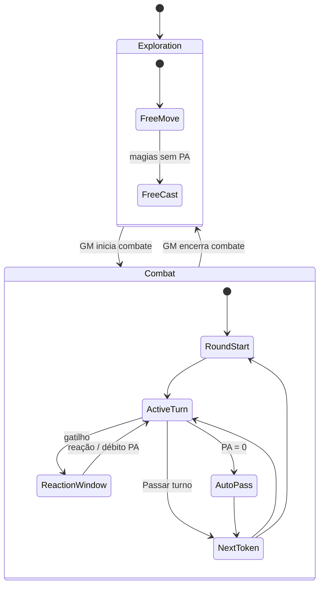

# PRD — Refatoração Combate & Mesa Eldarin v4

| Campo | Valor |
|-------|--------|
| **Status** | **Approved v1.0** (discovery §8 respondido 2026-06-12) |
| **Autor** | Raul + assistente IA |
| **Data** | 2026-06-12 |
| **Substitui / complementa** | [PRD-ELDARIN-VTT.md](./PRD-ELDARIN-VTT.md) (D14 **revogado**), [VTT-ACOES-PA-AREAS.md](./VTT-ACOES-PA-AREAS.md), [P5-COMBAT-UX.md](./P5-COMBAT-UX.md) |
| **Fonte de regras** | `livros/LIVRO-DO-JOGADOR.md` Cap. 2.6, 3.1 |

---

## 1. Resumo executivo

Refatorar **combate**, **economia de PA**, **fluxo de turno** e **shell da mesa** para sessão Eldarin completa: exploração livre + combate com iniciativa, automação máxima no servidor, **grid quadrado** (1 célula = 1,5 m), HUD jogador/monstro, paridade mobile.

**North star:** *“O grupo joga uma sessão inteira no browser sem planilha; o livro v4 e o JSON batem; o mestre narrativa, o VTT resolve.”*

---

## 2. Decisões confirmadas

### 2.1 Estrutura (sessão 1)

| ID | Decisão |
|----|---------|
| **R1** | PA Livro v4: +5/turno, pool máx. **9**, gasto livre no turno, auto-pass em PA=0 |
| **R2** | Escopo: sessão inteira + UX/regras ponta a ponta |
| **R3** | Automação máxima no servidor |
| **R4** | Iniciativa 1d20+DES + fim de turno por PA esgotado |
| **R5** | Mestre liga/desliga **modo combate** |
| **R6** | Movimento: pés fantasia clássica, faixas walk/run, 1º bloco = 1 PA |
| **R7** | Reações v1: ataque de oportunidade, Escudo, Contramágica |
| **R8** | **Sem slot “ação bônus”** — tudo via **PA** |
| **R9** | Undo: só mestre; **checkpoint 20 rodadas** |
| **R10** | Monstros: mestre controla; delegação rara |
| **R11** | Mobile: paridade com desktop |
| **R12** | Layout atual (rail Foundry) + **HUD dedicado** jogador/monstro |
| **R13** | Culinária/loot pós-combate: **fase 2** |

### 2.2 PA & ações (sessão 2)

| ID | Decisão |
|----|---------|
| **R14** | **Ataque Extra (Guerreiro 5+):** cada golpe extra custa **2 PA** (ataque normal). **Talentos** podem reduzir PA em **1 ou 2 ataques**, **1× por turno** (só nesses golpes). |
| **R15** | **Estribilho** (substitui “cantrip”): **1 PA**; máximo **2 estribilhos iguais por turno** (magias nv.0 / truques). |
| **R16** | Ex-“ação bônus”: em geral **1 PA**. **Segundo Fôlego:** **1 PA**, **1× por combate**. |
| **R17** | **Ajudar / Evadir / Disparada:** **1 PA** cada na v1. |
| **R18** | **Fora de combate:** movimento **livre, sem PA**; magias **não gastam PA**. |
| **R19** | **Ataque de oportunidade** (e reações fora do turno em exploração): **não gastam PA** quando disparados fora do modo combate; em combate seguem regra de reação (R21). |

### 2.3 Turno & iniciativa

| ID | Decisão |
|----|---------|
| **R20** | **Surpresa / entrada tardia:** todos presentes rolam iniciativa; quem **entra depois** só age **no fim da rodada atual**; na **rodada seguinte** entra na ordem normal. |
| **R21** | **Empate iniciativa:** **d100** até desempatar (só para iniciativa). |
| **R22** | **Auto-pass:** delay **configurável** pelo mestre (padrão ~1,5 s). |
| **R23** | **Reação sem PA no pool:** **débito** — no próximo turno recupera **4 PA** em vez de 5 (1 PA “emprestado”). |
| **R24** | **Checkpoint:** mestre pode voltar até **20 rodadas** atrás; jogador **vê** aviso no chat quando mestre desfaz/restaura. |

### 2.4 Combate automático

| ID | Decisão |
|----|---------|
| **R25** | **0 HP:** **inconsciente** imediato. Contador de morte: **10 rodadas** sem qualquer cura → morte. Ao chegar em 0, contador mínimo **−1** (dano extra não piora além disso). |
| **R26** | **XP:** automático ao derrotar token; mestre pode **desativar XP de monstros**, dar **XP manual a todos**, ou **subir 1 nível direto** a todos. |
| **R27** | **Friendly fire (área):** **confirmação obrigatória** se aliado na área. |
| **R28** | **Grid:** mapa em **grid quadrado** (não simétrico); **1 célula = 1,5 m**. Terminologia usuário: **célula** / **grid** (código interno pode manter ids legados `*Cell*` até Epic E10). |

### 2.5 Sync (recomendação técnica — Raul)

| ID | Decisão / recomendação |
|----|------------------------|
| **R29** | **Fase 1 (esta refatoração):** manter HTTP + **poll 500 ms em modo combate**, 2 s em exploração — sem WebSocket obrigatório. |
| **R30** | **Fase 2:** WebSocket (ou SSE) quando houver >3 salas simultâneas ou latência perceptível; prioridade após E1–E4 estáveis. |

**Por que não WebSocket agora:** menor risco para dev solo; poll mais rápido em combate resolve 80% da latência; Neon + REST combina bem com Docker; WebSocket exige infra extra (Room channel, reconexão, auth).

---

## 3. Terminologia canônica

| Antigo | Novo |
|--------|------|
| Cantrip | **Estribilho** |
| Ação bônus (slot) | **Ação rápida** — custo **PA** (geralmente 1) |
| Célula (mapa) | **Célula** / **grid quadrado** |
| PA /11, teto 11 | **PA /9** pool (talento Lobo Solitário: até 11) |

---

## 4. Épicos & prioridade

| Epic | Nome | Prioridade |
|------|------|------------|
| E1 | PA v4 + Estribilho + ação rápida 1 PA | P0 |
| E2 | Modo combate / exploração (GM toggle) | P0 |
| E3 | Iniciativa, d100, entrada tardia, reações v1, débito PA | P0 |
| E4 | Morte (−1/10 rodadas), XP configurável, friendly fire | P0 |
| E5 | Movimento grid, walk/run | P1 |
| E6 | HUD jogador/monstro | P1 |
| E7 | Checkpoint 20 rodadas + undo mestre | P1 |
| E8 | Poll combate 500 ms | P1 |
| E9 | Mobile paridade | P1 |
| E10 | Renomear APIs legadas → `*cell*` + migração geométrica se ainda célula no canvas | P2 |
| E11 | Culinária/loot na mesa | P2 (fase 2) |

---

## 5. Requisitos funcionais (fechados)

### E1 — PA
- RF1.1: Início do turno: `pa = min(cap, pa + 5)`; cap 9 (11 com Lobo Solitário).
- RF1.2: Atordoado: `pa = 0`.
- RF1.3: Estribilho: 1 PA; bloquear 3º+ uso da **mesma** magia nv.0 no turno.
- RF1.4: Ação rápida (ex-bônus): 1 PA salvo exceções documentadas (Segundo Fôlego 1/combate).
- RF1.5: Ataque Extra: 2 PA/golpe; talentos aplicam −1 PA em até 2 golpes, 1×/turno.

### E2 — Modos
- RF2.1: `room.mode`: `exploration` | `combat`.
- RF2.2: Exploração: movimento livre, magias sem PA, sem ordem de turno.
- RF2.3: Combate: iniciativa obrigatória; ações gastam PA.

### E3 — Turno
- RF3.1: Empate: d100 repetido.
- RF3.2: Reforço: entra fim da rodada; próxima rodada na ordem.
- RF3.3: Reações v1: oportunidade, Escudo, Contramágica; 1/rodada; débito PA se pool vazio.
- RF3.4: Auto-pass configurável na sala.

### E4 — Morte & XP
- RF4.1: HP≤0 → inconsciente; `deathTurns` inicia em −1; incrementa +1 por rodada sem cura; em 10 → morto.
- RF4.2: XP on defeat; flags mestre: `xpEnabled`, `grantXpAll`, `levelUpAll`.
- RF4.3: Área com aliado: modal confirmação.

### E7 — Undo
- RF7.1: Ring buffer **20 snapshots** (início de cada rodada).
- RF7.2: Chat: `Mestre restaurou a rodada N` / `Mestre desfez a última ação`.

---

## 6. Critérios de aceite

- [ ] UI/docs sem PA `/11` global (exceto talento Lobo Solitário).
- [ ] Livro Cap. 3.1 sem slot “ação bônus”; Estribilho documentado.
- [ ] Modo exploração: mover sem PA; combate: bloqueia fora do turno.
- [ ] 3 reações v1 funcionais com débito PA.
- [ ] Morte: inconsciente + contador 10 rodadas.
- [ ] Mestre desativa XP e pode level-up manual.
- [ ] Friendly fire: confirmação.
- [ ] Checkpoint 20 rodadas.
- [ ] iPhone 390px: combate completo.

---

## 7. Apêndice — Diagrama de modos

---

## 8. Histórico §8 (respostas Raul)

Todas as perguntas da discovery §8 foram respondidas — ver decisões R14–R30 acima.
