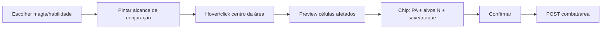

# VTT — PA, movimento, habilidades e áreas (spec técnica)

> Complementa [PRD-COMBATE-MESA-REFACTOR.md](./PRD-COMBATE-MESA-REFACTOR.md) e **Epic 9** do [PRD-ELDARIN-VTT.md](./PRD-ELDARIN-VTT.md).  
> **Grid quadrado:** 1 célula = 1,5 m (terminologia usuário). IDs legados `*Cell*` no código → Epic E10.

---

## 1. PA — o que mostrar antes de confirmar

Toda ação na mesa deve exibir **PA efetivo** (não só o custo bruto do JSON):

| Fonte | Função | UI |
|-------|--------|-----|
| Compêndio | `tactical.custoPontosAcao.value` | Custo base **1, 2 ou 3 PA** (ataque arma padrão **2 PA** se omitido) |
| Compêndio | `spell.recarga` / `ability.recarga` | `1/turno` ou `1/combate` — tag no picker |
| Motor | `effectivePaCost(actor, action, ctx?)` | Custo após talentos / Afinidade / Guerreiro |
| Motor | `totalAttackPaCost` | Multi-ataque arma |
| Motor | `paMaxForActor` (PC) / `MONSTER_PA_MIN` 6 (NPC) + token `pa` | “Gasta X · restam Y” |
| Turno | `scheduleAutoPassWhenActivePaZero` | **PA = 0** → passagem automática (~1,5 s) |

**Chip padrão no hover/rodapé:**

```text
PA: 2 → 1 (Afinidade) · Restam 4/6
```

---

## 2. Movimento e PA

### Regra (livro + código)

| Modo | PA | Implementação |
|------|-----|----------------|
| Movimentação | **Faixas** | `lib/vtt/movement-pa.ts` — 1º bloco = 1 PA; meio livre; corrida a partir de `walk+2` |
| Alcance / preview | **Pés (D&D)** | `lib/vtt/movement-feet.ts` — BFS com diagonais 5/10 ft; não quadrado Chebyshev |
| Caminho | Rota no grid | `lib/vtt/movement-path.ts` + `useBattlefieldHighlights` |
| Limite | walk / run | Por ficha/monstro; ex. walk 4 run 7: cél. 1–2 → 1 PA; 3–5 livre; 6+ → PA corrida |

Arquivos: `lib/vtt/movement.ts`, `lib/vtt/movement-feet.ts`.

### UX (modo jogo)

1. Botão **Caminhar** / **Correr** (`move-walk` / `move-run`).
2. Preview de alcance em **pés** ao longo de rota válida (obstáculos e ocupação).
3. Células: verde = caminhada grátis; âmbar = corrida (+PA).
4. **Hover no destino:** `+0 PA` / `+1 PA (corrida)` · metros restantes · PA insuficiente em vermelho.
5. Clique confirma → `POST tokens/move`.

---

## 3. Habilidades — alvo, PA, área

### Tipos hoje (`lib/combat/compendium-actions.ts`)

| Efeito | Alvo | Área |
|--------|------|------|
| `melee_attack_bonus`, `spell_strike` | Token inimigo | Não |
| `charge`, `shadow_step`, buffs | Self / aliado | Não |
| `restrain`, saves | Token | Não |
| (futuro) rugido, nuvem, enxame | Vários | **Sim** |

### UX por tipo

| Tipo | Fluxo mapa |
|------|------------|
| Alvo único | Igual ataque: alcance célula → hover preview vantagem → clique alvo |
| Self / aliado | Alcance 0–1 célula; clique no token aliado |
| **Área** | Ver §4 |

**PA:** sempre `effectivePaCost(actor, abilityAction)` no painel e no hover antes de confirmar.

---

## 4. Áreas — modelo de dados (livro → JSON)

### Conversão livro ↔ célula

| Livro (métrico) | Célula (1 célula = 1,5 m) | Fórmula |
|-----------------|---------------------|---------|
| 3 m | 2 célula | `round(m / 1.5)` |
| 6 m raio | 4 célula | `round(6 / 1.5)` |
| 9 m | 6 célula | idem |
| 12 m | 8 célula | idem |

Constante: `METERS_PER_CELL = 1.5` (`lib/vtt/movement.ts`).

### Formas suportadas (alvo v2)

| `shape` | Uso no livro | Parâmetros | Motor hoje |
|---------|--------------|------------|------------|
| `single` | Alvo único | — | ✅ |
| `burst` | Raio, esfera, “área X m” | `radiusCells` | ✅ `cellsInRange` |
| `wall` | Muralha, parede | `cellCount`, origem + vizinhos | ✅ parcial |
| `cone` | Cone de frio, mordida | `lengthCells`, `direction` (q,r) | ❌ gerar `coneCells()` |
| `line` | Raio, ventania, linha | `lengthCells`, `direction` | ❌ gerar `lineCells()` |
| `cube` | Cubo (Onda de Trovão) | `sizeCells` (lado) | ❌ tratar como `burst` com raio derivado ou cubo em célula |

**Schema JSON (magias e habilidades):**

```json
{
  "tactical": {
    "alcanceCells": { "value": 6 },
    "custoPontosAcao": { "value": 2 }
  },
  "spell": {
    "area": {
      "shape": "burst",
      "radiusCells": 2,
      "origin": "center",
      "friendlyFire": false
    }
  }
}
```

**Habilidades** — mesmo bloco em `system.tactical.area` ou `system.ability.area` (espelhar `spell.area`).

### Onde preencher no pipeline

| Passo | Quem |
|-------|------|
| 1 | Texto no `livros/LIVRO-DO-JOGADOR.md` / catálogo (metros + forma) |
| 2 | `scripts/generate-compendium.mjs` — helper `metersToCells(n)` + `area: { shape, ... }` |
| 3 | Habilidades com área: entrada explícita em `habilidades.json` ou mapa em `compendium-actions.ts` |
| 4 | `npm run sync:data` + `sync:data:check` valida `shape` ∈ enum |

**Exemplos já no gerador:**

- `Muralha Segmentada` → `wall`, `cellCount: 3`
- `Bola de Fogo` / `Nova Radiante` → `burst`, `radiusCells: 2`

**Gap livro:** “Cubo”, “cone”, “linha” no texto — falta `area` no JSON de várias magias (ex. Onda de Trovão só diz “Cubo” na descrição).

---

## 5. UX — colocar área na mesa (fluxo jogo)

### Magia / habilidade com `area.shape !== single`



| Passo | UI | Servidor |
|-------|-----|----------|
| Alcance | Células até `rangeCells` do caster | `canCastAreaAt` |
| Centro | Clique em célula vazio ou token | `centerQ/R` |
| Cone/linha | 2º clique = direção (vizinho do centro) | `direction` no body |
| Preview | `computeSpellAreaCells` + highlight vermelho | Mesma fn |
| Alvos | Tokens em `tokensInArea` — lista + preview save/VD | `resolveAreaSpell` |
| PA | `effectivePaCost` antes de confirmar | Deduz no handler |

**Cores sugeridas:**

- Azul claro: alcance de conjuração
- Laranja: área preview (hover)
- Borda roxa: tokens que serão atingidos

### Ataque em área (save em lote)

- Hover no centro mostra **quais tokens** entram e **VD/Save** por alvo (sem rolar).
- Confirma → um POST; chat pode detalhar por alvo (já faz loop em `combat-area.ts`).

---

## 6. Arquivos a criar / alterar (P5)

| Arquivo | Mudança |
|---------|---------|
| `lib/vtt/grid-area.ts` | **Novo:** `coneCells`, `lineCells`, `cubeCells`, unificar `computeAreaCells` |
| `lib/combat/area-spell.ts` | Usar grid-area; suportar cone/line |
| `lib/combat/preview-action.ts` | **Novo:** preview ataque + PA + roll mode sem rolar |
| `lib/combat/preview-move.ts` | **Novo:** wrap `canMoveToken` + labels PA |
| `hooks/vtt/useActionPreview.ts` | Chip UI: PA, vantagem, movimento |
| `components/vtt/Battlefield.tsx` | Modos unificados; 2-step direction para cone/line |
| `scripts/generate-compendium.mjs` | `metersToCells`, preencher `area` em todas magias de área do livro |
| `data/compendiums/magias.json` | Regenerar |
| `data/compendiums/habilidades.json` | `area` onde livro indicar |
| `livros/LIVRO-DO-JOGADOR.md` | Tabela “formas de área na mesa digital” (opcional Cap. 3.1) |

---

## 7. Checklist conteúdo (100% livro)

Para cada magia/habilidade de área no livro:

- [ ] `shape` + parâmetros em célula
- [ ] `custoPontosAcao` no tactical
- [ ] `alcanceCells` (distância até o **centro** da área)
- [ ] `save` ou `attack` + fórmula dano
- [ ] Teste na `/mesa/demo` com preview laranja

---

*Spec v1.0 — Epic 9 PRD v2.1+*
